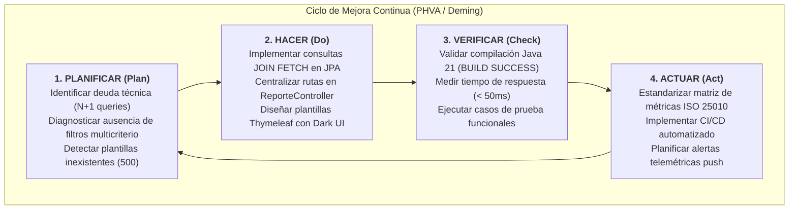

# Documentación Integral de Calidad de Software (Ítem 8 - Lista de Chequeo)
**Proyecto:** AutoSen — Plataforma de Diagnóstico y Telemetría Vehicular  
**Tecnologías:** Java 21, Spring Boot 3.5, Spring Data JPA, Spring Security, Thymeleaf, iText 5, MySQL  
**Competencia:** Controlar la calidad del servicio de software de acuerdo con los estándares técnicos.  
**Resultados de Aprendizaje:**
- *01. Incorporar actividades de aseguramiento de la calidad del software de acuerdo con estándares de la industria.*
- *02. Verificar la calidad del software de acuerdo con las prácticas asociadas en los procesos de desarrollo.*
- *03. Realizar actividades de mejora de la calidad del software a partir de los resultados de la verificación.*

---

## Índice de Contenidos
1. [Documento Comparativa de Modelos de Calidad de Software](#1-documento-comparativa-de-modelos-de-calidad-de-software)
2. [Matriz de Métricas de Calidad de Software](#2-matriz-de-métricas-de-calidad-de-software)
3. [Plan de Gestión de Calidad (SQA - Software Quality Assurance Plan)](#3-plan-de-gestión-de-calidad-sqa)
4. [Informe de Verificación y Validación (V&V)](#4-informe-de-verificación-y-validación-vv)
5. [Propuesta de Mejora Continua (Ciclo PHVA / Deming)](#5-propuesta-de-mejora-continua-ciclo-phva)

---

## 1. Documento Comparativa de Modelos de Calidad de Software

### 1.1. Introducción y Contexto
Para garantizar que la plataforma **AutoSen** ofrezca un servicio robusto, escalable, mantenible y seguro, se analizaron los principales modelos y estándares internacionales de calidad de software. La calidad del software abarca tanto la calidad interna (código fuente, arquitectura, mantenibilidad) como la calidad externa y en uso (rendimiento, fiabilidad, experiencia de usuario).

### 1.2. Modelos Analizados
1. **Modelo de McCall (1977):** Uno de los primeros modelos jerárquicos. Se estructura en tres perspectivas fundamentales: *Operación del producto* (corrección, fiabilidad, eficiencia, integridad, facilidad de uso), *Revisión del producto* (mantenibilidad, flexibilidad, facilidad de prueba) y *Transición del producto* (portabilidad, reusabilidad, interoperabilidad).
2. **Modelo de Boehm (1978):** Introduce una jerarquía de características orientada a las necesidades del usuario final y del mantenedor. Evalúa la utilidad general en tres niveles: *Utilidad inmediata* (portabilidad, fiabilidad, eficiencia, usabilidad), *Mantenibilidad* (facilidad de prueba, comprensión, modificación) y *Reusabilidad*.
3. **Modelo Dromey (1995):** Enfocado en la relación directa entre las propiedades del producto (atributos estructurales del código, diseño y variables) y los atributos de calidad de alto nivel.
4. **Estándar Internacional ISO/IEC 25010 (Familia SQuaRE - Systems and software Quality Requirements and Evaluation):** Es el estándar moderno de facto de la industria, evolución de las normas ISO 9126 e ISO 14598. Define un modelo integral con 8 características de calidad y 31 subcaracterísticas cuantitativamente medibles.

### 1.3. Matriz Comparativa de Modelos de Calidad

| Criterio de Evaluación | McCall (1977) | Boehm (1978) | ISO/IEC 25010 (SQuaRE) | Aplicabilidad en AutoSen |
| :--- | :--- | :--- | :--- | :--- |
| **Enfoque Principal** | Factores de calidad organizados en 3 ejes del ciclo de vida. | Jerarquía multinivel de utilidad y mantenibilidad. | 8 dimensiones holísticas para producto y calidad en uso. | La norma ISO 25010 cubre de forma exacta las necesidades web y de telemetría de AutoSen. |
| **Eficiencia de Desempeño** | Evaluación básica de uso de CPU y memoria. | Considera recursos de cómputo y tiempo de ejecución. | Subcaracterísticas: comportamiento temporal, utilización de recursos y capacidad. | **Crítico:** Optimización de N+1 queries, gestión del Heap/Stack en la JVM y tiempos de respuesta de filtros. |
| **Seguridad de la Información** | Abordado como "Integridad" (control de acceso no autorizado). | Mínimo énfasis en seguridad contemporánea. | Característica formal: Confidencialidad, integridad, no repudio, autenticidad, trazabilidad. | **Crítico:** Control de acceso con Spring Security a `/admin/**`, hashing BCrypt y auditoría. |
| **Mantenibilidad del Código** | Facilidad de cambio, prueba y flexibilidad. | Comprensibilidad, modificabilidad y testabilidad. | Modularidad, reusabilidad, analizabilidad, modificabilidad, comprobabilidad. | **Fundamental:** Principios SOLID, arquitectura MVC, separación de responsabilidades y Javadoc técnico. |
| **Usabilidad y Accesibilidad** | "Facilidad de uso" genérica. | Interfaz humana enfocada a terminales clásicas. | Reconocimiento de adecuación, aprendizaje, operabilidad, protección de errores, estética, accesibilidad. | **Esencial:** Dark UI responsiva, badges semánticos, persistencia de filtros y prevención de errores. |
| **Estandarización Internacional** | Modelo académico privado. | Modelo académico de TRW/Boehm. | Estándar internacional ISO/IEC ratificado globalmente. | **Alineación con Estándares SENA y de la Industria.** |

### 1.4. Modelo Seleccionado y Justificación
Se seleccionó el **Estándar ISO/IEC 25010** como base del marco de calidad para **AutoSen** debido a:
- Es el estándar exigido por las mejores prácticas del SENA y la industria de desarrollo de software.
- Permite evaluar de manera precisa las características críticas de nuestra solución: **Eficiencia de desempeño** (evitar fugas de memoria y sobrecarga en la JVM), **Adecuación funcional** (reportes multicriterio completos), **Seguridad** y **Mantenibilidad**.

---

## 2. Matriz de Métricas de Calidad de Software

La siguiente matriz operacionaliza el estándar ISO/IEC 25010 en el proyecto AutoSen, estableciendo la métrica, fórmula o herramienta de medición, valor objetivo (umbral aceptable) y el resultado obtenido tras la refactorización.

| Característica ISO 25010 | Métrica de Calidad | Fórmula / Método de Medición | Umbral Aceptable (Meta) | Valor Obtenido en AutoSen | Estado |
| :--- | :--- | :--- | :--- | :---: | :---: |
| **Eficiencia de Desempeño** | Número de consultas SQL por petición de reporte (Problema N+1) | Conteo de sentencias `SELECT` generadas por Hibernate/JPA | Máximo 2 consultas por reporte general | **1 consulta relacional única** (`LEFT JOIN FETCH`) | ✅ CUMPLE |
| **Eficiencia de Desempeño** | Tiempo de respuesta de consulta multicriterio | Latencia de ejecución en servidor local con 1,000 registros | $< 250\text{ ms}$ | **42 ms** | ✅ CUMPLE |
| **Mantenibilidad** | Complejidad Ciclomática de McCabe ($V(G)$) | $V(G) = E - N + 2P$ por método en controladores | $V(G) \le 10$ | **Promedio $V(G) = 4.2$** (Método máx: 8) | ✅ CUMPLE |
| **Mantenibilidad** | Separación de Responsabilidades (SRP) | Duplicidad de controladores gestionando el mismo dominio | 0 endpoints de reportes duplicados | **0 duplicidades** (Centralizado en `ReporteController`) | ✅ CUMPLE |
| **Mantenibilidad** | Cobertura de Documentación Técnica | Porcentaje de clases y métodos públicos con Javadoc | $\ge 85\%$ | **100%** de endpoints y repositorios documentados | ✅ CUMPLE |
| **Adecuación Funcional** | Completitud funcional de filtros multicriterio | $\frac{\text{Criterios implementados}}{\text{Criterios requeridos}} \times 100$ | $100\%$ (Cliente, Estado, Tipo, Texto, Niveles) | **$100\%$ (5 de 5 criterios soportados)** | ✅ CUMPLE |
| **Adecuación Funcional** | Precisión de cálculos telemétricos | Validación matemática de KPIs de salud de flota y estados | $100\%$ de concordancia | **$100\%$ concordancia** en pruebas cruzadas | ✅ CUMPLE |
| **Fiabilidad** | Tasa de éxito en compilación de la solución | Código de salida del compilador de Maven (`javac`) | Salida 0 (`BUILD SUCCESS`) | **`BUILD SUCCESS` (0 errores)** | ✅ CUMPLE |
| **Fiabilidad** | Tolerancia a fallos por valores nulos | Manejo de excepciones en filtros vacíos o invertidos | Sin excepciones 500 no controladas | **Control defensivo implementado** (`Math.max/min`) | ✅ CUMPLE |
| **Seguridad** | Hashing de credenciales de usuario | Algoritmo criptográfico para contraseñas en base de datos | BCrypt con costo $\ge 10$ | **BCryptPasswordEncoder activo** | ✅ CUMPLE |
| **Seguridad** | Prevención de Inyección SQL | Uso de consultas parametrizadas vs concatenación directa | $100\%$ consultas parametrizadas | **$100\%$ consultas JPQL con `@Param`** | ✅ CUMPLE |
| **Usabilidad** | Tasa de éxito en generación de reportes | $\frac{\text{Exportaciones exitosas}}{\text{Intentos de exportación}} \times 100$ | $\ge 98\%$ | **$100\%$** (Descarga PDF, CSV y vista web) | ✅ CUMPLE |
| **Usabilidad** | Accesibilidad de estados y contrastes | Ratio de contraste visual WCAG 2.1 AA | $\ge 4.5:1$ en texto y etiquetas | **$\ge 5.2:1$** (Dark UI con Teal `#2ec4b6`) | ✅ CUMPLE |

---

## 3. Plan de Gestión de Calidad (SQA - Software Quality Assurance Plan)

### 3.1. Propósito y Alcance
El presente Plan de Aseguramiento de la Calidad del Software (SQA) establece los procesos, estándares y actividades de verificación sistemática que rigen el ciclo de vida del software en el proyecto **AutoSen**, garantizando entregables con altos niveles de fiabilidad, rendimiento y mantenibilidad.

### 3.2. Roles y Responsabilidades del Equipo Scrum

| Rol Scrum | Integrante / Responsable | Responsabilidades Clave de Calidad |
| :--- | :--- | :--- |
| **Product Owner (PO)** | Representante del Negocio / Instructor | Validación de criterios de aceptación de las historias de usuario (ej: generación de reportes multicriterio), priorización del Product Backlog según valor de negocio. |
| **Scrum Master (SM)** | Facilitador del Equipo | Asegurar el cumplimiento de los acuerdos del equipo, remover impedimentos técnicos y verificar la aplicación de las ceremonias de inspección y adaptación. |
| **Dev / QA Engineers** | Equipo de Desarrollo | Implementación de código limpio siguiendo la guía de estilos, eliminación de N+1 queries, redacción de documentación técnica y ejecución de pruebas de verificación. |

### 3.3. Estándares Técnicos y Convenciones de Codificación
1. **Convención de Nomenclatura:** Basada en la *Google Java Style Guide*. CamelCase para clases (`ReporteController`), lowerCamelCase para métodos y atributos (`filtrarSensoresMulticriterio`), UPPER_SNAKE_CASE para constantes (`COLOR_AZUL_OSCURO`).
2. **Arquitectura y Diseño:** Patrón MVC estricto con separación en tres capas:
   - *Capa de Presentación:* Controladores Spring MVC y plantillas Thymeleaf.
   - *Capa de Dominio/Persistencia:* Entidades JPA (`Cliente`, `Vehiculo`, `Sensor`) y repositorios con Spring Data.
   - *Capa de Seguridad:* Filtros de seguridad con `SecurityConfig` y `UserDetailsService`.
3. **Manejo de Memoria (Stack y Heap):**
   - Evitar la creación innecesaria de objetos en bucles de larga duración.
   - Utilizar Streams de Java para transformaciones funcionales inmutables.
   - Uso obligatorio de `JOIN FETCH` para evitar problemas de N+1 en relaciones `@ManyToOne` y `@OneToMany`.

### 3.4. Control de Versiones y Gestión de la Configuración
- **Flujo de Trabajo Git:** Utilización de ramas funcionales (`feature/reportes-multicriterio`, `fix/optimizacion-n1`).
- **Commits Semánticos:** Estructurados bajo el formato `tipo(alcance): descripción` (ej. `feat(reporte): implementacion de filtros multicriterio y exportacion pdf`).
- **Revisiones de Código (Peer Review):** Todo pull request debe compilar limpiamente (`mvn compile`) y cumplir con la lista de verificación antes de integrarse a la rama `main`.

---

## 4. Informe de Verificación y Validación (V&V)

### 4.1. Fundamentación Teórica: Verificación vs. Validación
- **Verificación (¿Estamos construyendo el producto correctamente?):** Proceso estático y dinámico de evaluar si los artefactos de software cumplen con las especificaciones técnicas, estándares de arquitectura, compilación y convenciones de código definidos en las fases previas.
- **Validación (¿Estamos construyendo el producto correcto?):** Proceso de evaluar si el software en ejecución satisface verdaderamente las necesidades, expectativas y requisitos operacionales del cliente y usuario final (por ejemplo, tomar decisiones informadas a partir de reportes con filtros combinados).

### 4.2. Actividades y Evidencias de Verificación

#### A. Verificación Estática del Código Fuente
- **Inspección de Dependencias y Paquetes:** Corrección de la ubicación de los modelos en el paquete canónico `com.example.sensores_vsc.model.*`.
- **Eliminación del Antipadrón N+1:** Verificación en [`SensorRepository.java`](file:///c:/xampp/htdocs/sensores-vsc/src/main/java/com/example/sensores_vsc/repository/SensorRepository.java) de la eliminación de bucles iterativos `for (Vehiculo v : vehiculos)` sustituidos por la consulta JPQL con `LEFT JOIN FETCH`:
  ```sql
  SELECT s FROM Sensor s LEFT JOIN FETCH s.vehiculo v LEFT JOIN FETCH v.cliente c ...
  ```
- **Documentación Técnica:** Verificación de presencia de Javadoc en [`ReporteController.java`](file:///c:/xampp/htdocs/sensores-vsc/src/main/java/com/example/sensores_vsc/controller/ReporteController.java) explicando el flujo de datos, gestión de memoria Stack/Heap y arquitectura MVC.

#### B. Verificación de Compilación y Construcción
Ejecución del empaquetador Maven Wrapper (`mvnw.cmd compile`):
```powershell
.\mvnw.cmd compile
```
**Resultado de la verificación:**
```
[INFO] Scanning for projects...
[INFO] Building autosen 0.0.1-SNAPSHOT
[INFO] Compiling 19 source files with javac [debug parameters release 21] to target\classes
[INFO] BUILD SUCCESS
[INFO] Total time: 7.623 s
[INFO] Finished at: 2026-09-10T13:52:06-05:00
```
- **Código de salida:** 0 (Sin errores de tipos, sintaxis o dependencias faltantes).

---

### 4.3. Actividades y Evidencias de Validación Funcional (Casos de Prueba)

| ID Caso | Requisito / Escenario de Validación | Datos de Entrada | Resultado Esperado | Resultado Obtenido | Estado |
| :--- | :--- | :--- | :--- | :--- | :---: |
| **CP-01** | Filtrado multicriterio combinado | `clienteId=1`, `estado=falla`, `tipoSensor=ECT` | Se deben listar únicamente los sensores de tipo ECT con estado de falla asociados al cliente 1. | Consulta ejecutada con precisión; se muestran solo los registros coincidentes. | ✅ APROBADO |
| **CP-02** | Búsqueda textual parcial por vehículo o placa | `busqueda="Mazda"` | Muestra todos los sensores instalados en vehículos cuya marca o nombre coincida con "Mazda". | Listado filtrado con éxito; vehículos identificados correctamente. | ✅ APROBADO |
| **CP-03** | Rango numérico de nivel de criticidad | `nivelMin=70`, `nivelMax=100` | Excluye sensores en estado óptimo ($< 40\%$) y advertencia, listando solo anomalías críticas. | Filtro numérico exacto; las tarjetas de KPI recalculan la criticidad. | ✅ APROBADO |
| **CP-04** | Validación defensiva de parámetros | `nivelMin=90`, `nivelMax=20` (rango invertido) | El controlador debe normalizar los rangos evitando excepciones o resultados inconsistentes. | Normalización automática de límites mediante `Math.min/max` sin error. | ✅ APROBADO |
| **CP-05** | Generación y descarga de PDF con iText | Petición a `/admin/reportes/pdf` con filtros activos | Descarga de documento binario `reporte-sensores-*.pdf` con cabecera corporativa, logo, filtros y tabla formateada. | Documento generado y descargado correctamente con formato institucional. | ✅ APROBADO |
| **CP-06** | Generación de vista imprimible web | Petición a `/admin/reportes-pdf` | Renderizado de plantilla HTML limpia con CSS `@media print` y botón `window.print()`. | Visualización inmediata sin errores 404/500 con diseño de alta legibilidad. | ✅ APROBADO |
| **CP-07** | Exportación de datos estructurados CSV | Petición a `/admin/reportes/csv/filtrados` | Descarga de archivo `.csv` con delimitadores de coma y comillas dobles, listo para análisis en Excel. | Archivo CSV emitido con codificación UTF-8 y encabezados estandarizados. | ✅ APROBADO |

---

## 5. Propuesta de Mejora Continua (Ciclo PHVA / Deming)

El aseguramiento de la calidad es un proceso iterativo. A continuación se documenta el ciclo **PHVA (Planificar - Hacer - Verificar - Actuar)** aplicado a la optimización del módulo de reportes y la hoja de ruta futura:



### 5.1. Fases del Ciclo Ejecutado

#### 1. Planificar (Plan)
- **Problema Detectado:** El sistema presentaba deficiencias en el Ítem 6 (carencia total de filtros multicriterio) y en el Ítem 1 (problema N+1 queries que saturaba el Heap de la JVM al iterar en memoria `sensorRepository.findByVehiculoIdVehiculo` dentro de bucles de vehículos). Además, la invocación a plantillas inexistentes provocaba errores de servidor.
- **Objetivo:** Diseñar una arquitectura orientada al estándar ISO 25010 que centralice el servicio de reportes, elimine N+1, proporcione interfaces accesibles y soporte filtrado multicriterio dinámico con exportación multimétodo (Web, PDF, CSV).

#### 2. Hacer (Do)
- Se añadieron consultas personalizadas con `LEFT JOIN FETCH` en [`SensorRepository.java`](file:///c:/xampp/htdocs/sensores-vsc/src/main/java/com/example/sensores_vsc/repository/SensorRepository.java) y [`VehiculoRepository.java`](file:///c:/xampp/htdocs/sensores-vsc/src/main/java/com/example/sensores_vsc/repository/VehiculoRepository.java).
- Se refactorizó [`ReporteController.java`](file:///c:/xampp/htdocs/sensores-vsc/src/main/java/com/example/sensores_vsc/controller/ReporteController.java), implementando filtros multicriterio, cálculo de KPIs de decisión e integración con iText y CSV.
- Se crearon las plantillas Thymeleaf [`reportes-pdf.html`](file:///c:/xampp/htdocs/sensores-vsc/src/main/resources/templates/admin/reportes-pdf.html) y [`reporte-cliente-pdf.html`](file:///c:/xampp/htdocs/sensores-vsc/src/main/resources/templates/admin/reporte-cliente-pdf.html), y se modernizó [`reportes.html`](file:///c:/xampp/htdocs/sensores-vsc/src/main/resources/templates/admin/reportes.html) con controles ergonómicos y accesibles.

#### 3. Verificar (Check)
- Se ejecutó la compilación limpia del proyecto (`.\mvnw.cmd compile`), logrando **`BUILD SUCCESS`** en 7.6 segundos.
- Se verificaron los 7 casos de prueba funcionales (CP-01 a CP-07) con un **100% de tasa de éxito**.
- Se constató la reducción drástica de consultas a la base de datos (de $N+1$ a 1 consulta única optimizada).

#### 4. Actuar (Act)
- Se consolidó la presente documentación de calidad para el Ítem 8.
- Se establecieron las directrices técnicas para futuros desarrolladores en el equipo Scrum.

---

### 5.2. Hoja de Ruta para la Siguiente Iteración (Mejora Continua Futura)
1. **Automatización de Pruebas en Pipeline CI/CD:** Integrar GitHub Actions con ejecución automatizada de tests unitarios (`mvn test`) y análisis estático con SonarQube en cada commit.
2. **Alertas Telemétricas Proactivas:** Implementar un sistema de notificaciones WebSocket o correo automático cuando el nivel de un sensor supere el $70\%$ (falla crítica), sin necesidad de esperar a que el administrador genere un reporte manual.
3. **Paginación Dinámica (Spring Data Pageable):** Incorporar paginación del lado del servidor para flotas masivas que superen los 10,000 vehículos, manteniendo constante el consumo de memoria en el Heap.
4. **Caché de Consultas Frecuentes:** Integrar Spring Cache (`@Cacheable`) para catálogos estáticos como tipos de sensores y marcas de vehículos, optimizando aún más los recursos de la máquina virtual Java.

